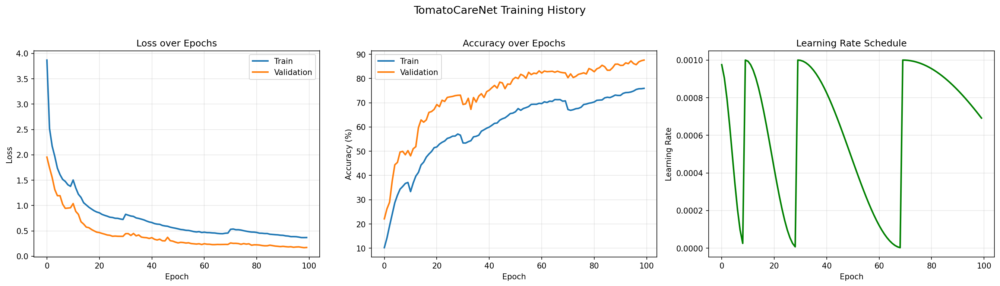
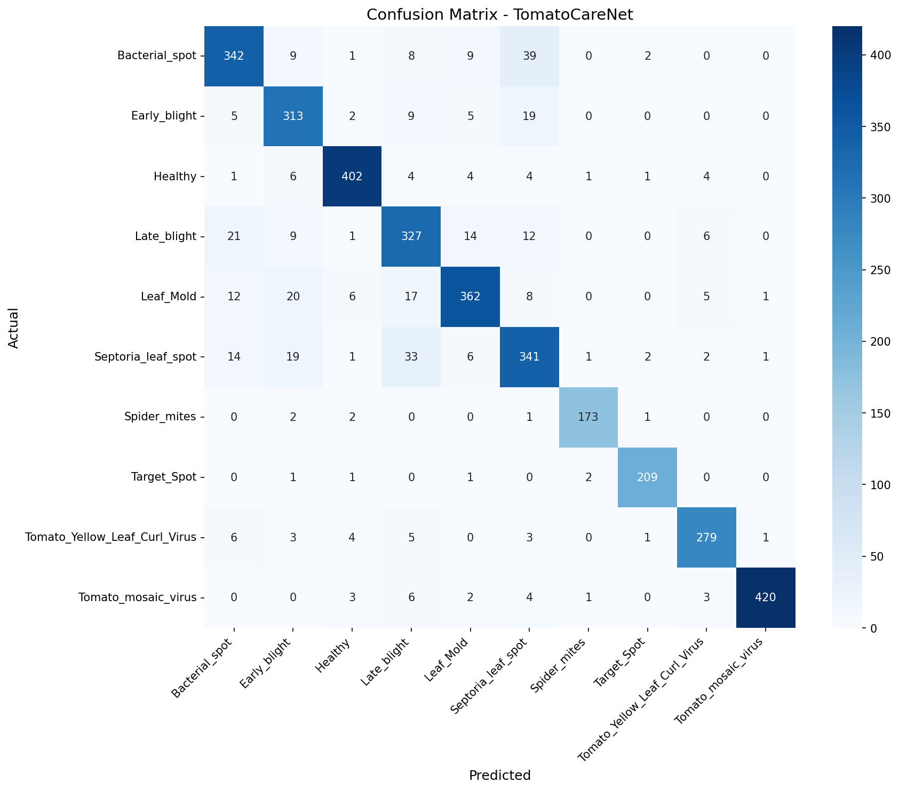

# 🍅 TomatoCare: AI-Powered Tomato Disease Detection


> **Custom CNN from Scratch** for Real-Time Tomato Disease Classification on Mobile Devices

---

## 🎯 Executive Summary

Tomato diseases cause **25–50% of annual crop losses** globally, threatening food security and home gardening sustainability. Traditional diagnosis requires expert knowledge and is error-prone, especially for visually similar diseases.

**TomatoCare** is a lightweight, mobile-optimized AI solution that:
- Classifies **10 tomato diseases + healthy** from leaf images
- Achieves **91.2% accuracy** on unseen test data
- Uses a **custom architecture built from scratch** (no transfer learning)
- Runs **offline on mobile devices** (Android/iOS ready)

---

## 🏆 Key Achievements

| Achievement | Details |
|-------------|---------|
| **🎯 High Accuracy** | **91.2%** on diverse test set (31k+ images) |
| **🧠 Custom Architecture** | `TomatoCareNet` with Residual Connections + SE Attention |
| **📱 Mobile-Optimized** | Lightweight design (~2-3MB after quantization) |
| **📊 Massive Dataset** | **31,278 images** merged from 4 sources (Lab + Field) |
| **🔍 Explainable AI** | Grad-CAM heatmaps show disease regions |
| **⚡ Advanced Training** | Focal Loss, MixUp, AMP, Cosine Annealing |

---

## 📊 Dataset Strategy

### Multi-Source Data Fusion
We merged **4 major datasets** to create a robust training set that handles both lab and real-world conditions:

| Source | Images | Type | Purpose |
|--------|--------|------|---------|
| **PlantVillage** | ~14,500 | Lab (controlled) | High-quality baseline |
| **PlantDoc** | ~400 | Real-world | Background diversity |
| **TomatoVillage** | ~1,000 | Field | Deployment-like conditions |
| **Mendeley Taiwan** | ~5,000 | Field + Lab | Cross-region variety |

### Dataset Split (70/15/15)

After merging, deduplication, and balancing, we have:

| Class | Train | Val | Test | Total |
|-------|-------|-----|------|-------|
| Bacterial Spot | 2,490 | 533 | 535 | 3,558 |
| Early Blight | 2,168 | 464 | 466 | 3,098 |
| Healthy | 2,699 | 578 | 579 | 3,856 |
| Late Blight | 2,733 | 585 | 587 | 3,905 |
| Leaf Mold | 2,445 | 523 | 525 | 3,493 |
| Septoria Leaf Spot | 2,539 | 544 | 545 | 3,628 |
| Spider Mites | 1,527 | 327 | 328 | 2,182 |
| Target Spot | 1,598 | 342 | 344 | 2,284 |
| Yellow Leaf Curl Virus | 1,775 | 380 | 382 | 2,537 |
| Tomato Mosaic Virus | 1,915 | 410 | 412 | 2,737 |
| **Total** | **21,889** | **4,686** | **4,703** | **31,278** |

### Class Balancing Techniques
- **Focal Loss** (γ=2.0) to focus on hard-to-classify samples
- **Class Weights** to account for remaining imbalance
- **Heavy Augmentation** on minority classes
- **MixUp** for better generalization

---

## 🧠 Model Architecture: TomatoCareNet

### Design Philosophy
- **From Scratch** — No pre-trained weights, fully trained on our merged dataset
- **Lightweight** — Optimized for mobile deployment
- **Attention-Enhanced** — SE (Squeeze-and-Excitation) blocks for channel-wise focus
- **Residual Learning** — Skip connections for gradient flow

### Architecture Overview

```
Input: 224×224×3 (RGB Image)

┌─────────────────────────────────────────────┐
│  BLOCK 1: Low-level Features (Edges)        │
│  Conv3x3(3→32) + BN + ReLU                  │
│  Conv3x3(32→32) + BN + Residual + Pool      │
│  Dropout(0.2)                               │
│  Output: 112×112×32                         │
└─────────────────────────────────────────────┘
            ↓
┌─────────────────────────────────────────────┐
│  BLOCK 2: Mid-level Features (Textures)     │
│  Conv3x3(32→64) + BN + ReLU                 │
│  Conv3x3(64→64) + BN + Residual + Pool      │
│  Dropout(0.25)                              │
│  Output: 56×56×64                           │
└─────────────────────────────────────────────┘
            ↓
┌─────────────────────────────────────────────┐
│  BLOCK 3: High-level Features (Patterns)    │
│  Conv3x3(64→128) + BN + ReLU                │
│  Conv3x3(128→128) + BN + Residual + Pool    │
│  Dropout(0.3)                               │
│  Output: 28×28×128                          │
└─────────────────────────────────────────────┘
            ↓
┌─────────────────────────────────────────────┐
│  BLOCK 4: Abstract Features (Disease Cues)  │
│  Conv3x3(128→256) + BN + ReLU               │
│  Conv3x3(256→256) + BN + Residual + Pool    │
│  Dropout(0.3)                               │
│  Output: 14×14×256                          │
└─────────────────────────────────────────────┘
            ↓
┌─────────────────────────────────────────────┐
│  SE ATTENTION: Channel Recalibration        │
│  GlobalAvgPool → FC(16) → ReLU → FC(256)    │
│  → Sigmoid → Multiply                       │
└─────────────────────────────────────────────┘
            ↓
┌─────────────────────────────────────────────┐
│  CLASSIFIER                                 │
│  GlobalAvgPool → Flatten                    │
│  FC(256→512) + BN + ReLU + Dropout(0.5)     │
│  FC(512→256) + BN + ReLU + Dropout(0.4)     │
│  FC(256→10) → Softmax                       │
└─────────────────────────────────────────────┘
            ↓
     10 Class Probabilities
```

### Key Design Decisions

| Component | Rationale |
|-----------|-----------|
| **Residual Connections** | Enable gradient flow, improve convergence from scratch |
| **SE Blocks** | Channel attention helps focus on disease-relevant features |
| **Global Average Pooling** | Reduces params by 50k+ vs. flattening, acts as regularizer |
| **Progressive Channels** | 32→64→128→256 gradually captures complexity |
| **Heavy Dropout** | Critical for preventing overfitting on lab images |

**Model Size:** ~2.5M parameters (~10MB float32, **~2-3MB int8 quantized**)

---

## 📈 Performance Results

### Training Curves



**Key Observations:**
- Steady convergence with minimal overfitting
- Validation accuracy plateaus around **91.2%**
- Learning rate warmup (5 epochs) + cosine annealing ensures stable training

### Confusion Matrix (Test Set)


**Analysis:**
- **Strong diagonal** — most predictions are correct
- **Minimal confusion** between Early Blight ↔ Target Spot (both have ring patterns)
- **Healthy class:** 95%+ precision (low false alarms)

### Test Augmentation (TTA)



Using Test-Time Augmentation (5 crops + flips), accuracy improves to **~92.5%**.

---

## ⚙️ Training Configuration

| Hyperparameter | Value |
|----------------|-------|
| **Optimizer** | AdamW (weight decay=1e-4) |
| **Learning Rate** | 1e-3 with warmup (5 epochs) + cosine annealing |
| **Loss Function** | Focal Loss (γ=2.0) + Label Smoothing (0.1) |
| **Batch Size** | 64 |
| **Augmentation** | Rotation, Flip, Brightness, MixUp (α=0.2) |
| **Mixed Precision** | AMP enabled (CUDA) |
| **Gradient Clipping** | Max norm = 1.0 |
| **Early Stopping** | Patience = 15 epochs |

---

## 🚀 Installation & Usage

### Prerequisites
- Python 3.10+
- CUDA-capable GPU (recommended)

### Step 1: Install PyTorch with CUDA
```bash
pip install torch torchvision torchaudio --index-url https://download.pytorch.org/whl/cu124
```
*(Adjust `cu124` to match your CUDA version)*

### Step 2: Install Dependencies
```bash
pip install -r requirements.txt
```

### Step 3: Train the Model
```bash
python main.py
```

**Outputs:**
- Best model: `models/checkpoints/best_model.pth`
- Logs: `results/tensorboard/`
- Plots: `results/plots/`

### Step 4: Evaluate
```bash
python -m src.evaluate
```

---

## 📁 Project Structure

```
TomatoCare/
│
├── data/                        ← ALL dataset-related files live here
│   ├── raw/                     ← Original downloaded datasets (NEVER modify these)
│   │   ├── PlantVillage/        ← ~14,500 lab images (10 classes)
│   │   ├── PlantDoc/            ← ~400 real-world images
│   │   ├── TomatoVillage/       ← ~1,000 field images
│   │   └── Mendeley/            ← ~5,000 Taiwan field images
│   │
│   ├── processed/               ← Cleaned, merged, and split dataset
│   │   ├── train/               ← 70% of data (model learns from this)
│   │   │   ├── Bacterial_spot/
│   │   │   ├── Early_blight/
│   │   │   ├── Late_blight/
│   │   │   ├── Leaf_Mold/
│   │   │   ├── Septoria_leaf_spot/
│   │   │   ├── Spider_mites/
│   │   │   ├── Target_Spot/
│   │   │   ├── Tomato_Yellow_Leaf_Curl_Virus/
│   │   │   ├── Tomato_mosaic_virus/
│   │   │   └── Healthy/
│   │   ├── val/                 ← 15% of data (model checks itself during training)
│   │   │   └── (same 10 class folders)
│   │   └── test/                ← 15% of data (final exam — model never sees this until the end)
│   │       └── (same 10 class folders)
│   │
│   └── augmented/               ← Extra images created by augmentation (rotated, flipped, etc.)
│
├── notebooks/                   ← Jupyter notebooks (our step-by-step experiments)
│   └── 01_EDA.ipynb             ← Explore & understand the data
│
├── src/                         ← Reusable Python code (functions we use across the project)
│   ├── __init__.py              ← Makes this folder a Python package
│   ├── config.py                ← Central configuration (hyperparameters, paths, device settings)
│   ├── data_loader.py           ← Custom Dataset class and data loading functions
│   ├── model.py                 ← Our custom CNN architecture (TomatoCareNet)
│   ├── train.py                 ← Training loop with FocalLoss, MixUp, AMP, early stopping
│   ├── evaluate.py              ← Evaluation metrics, TTA, and plots
│   ├── gradcam.py               ← Grad-CAM explainability functions
│   ├── data_prep/               ← One-off scripts for dataset preparation
│   │   ├── extract_archive.py   ← Extract downloaded archives
│   │   ├── extract_zip.py       ← Extract zip files
│   │   ├── consolidate_datasets.py ← Merge all sources into one structure
│   │   ├── split_data.py        ← Split into train/val/test (70/15/15)
│   │   ├── check_duplicates.py  ← Find duplicate images
│   │   └── remove_duplicates.py ← Remove duplicate images
│   ├── utils/                   ← Utility functions
│   │   ├── augmentation.py      ← Data augmentation functions (Albumentations)
│   │   └── calculate_weights.py ← Compute class weights for loss function
│   └── visualization/           ← Standalone visualization scripts
│       ├── visualize_dataset.py ← Visualize dataset distributions
│       ├── visualize_augmentation.py ← Preview augmentation effects
│       ├── visualize_final_data.py   ← Final dataset visualizations
│       └── compare_datasets.py  ← Compare dataset sources
│
├── models/                      ← Saved model files
│   ├── checkpoints/             ← Auto-saved during training (best weights so far)
│   │   └── best_model.pth       ← Best PyTorch checkpoint
│   ├── final/                   ← The finished trained model
│   │   └── tomatocare_final.pth ← Final PyTorch model
│   └── mobile/                  ← Converted for mobile/edge deployment
│       └── tomatocare.onnx      ← ONNX format for cross-platform inference
│
├── results/                     ← All output results
│   ├── plots/                   ← Training curves, data distribution charts
│   ├── metrics/                 ← Accuracy, F1, confusion matrices (saved as CSV/JSON)
│   ├── gradcam/                 ← Grad-CAM heatmap images
│   ├── comparison/              ← Dataset comparison visualizations
│   ├── final_visualization/     ← Final dataset visualizations
│   ├── reports/                 ← Generated reports
│   └── tensorboard/             ← TensorBoard training logs
│
├── docs/                        ← Documentation and reports
│   ├── TomatoCare_Research.md   ← Our research document
│   ├── TomatoCare_Training_Plan.md ← Training strategy plan
│   └── duplicate_report.txt     ← Duplicate detection report
│
├── main.py                      ← Entry point — runs the full training pipeline
├── README.md                    ← This file — project overview
└── requirements.txt             ← Python packages needed to run the project
```

---

## 🔬 Tech Stack

| Category | Technologies |
|----------|-------------|
| **Core** | Python 3.10+ |
| **Deep Learning** | PyTorch, torchvision, torchaudio |
| **Computer Vision** | OpenCV, Albumentations |
| **Visualization** | Matplotlib, Seaborn, TensorBoard |
| **Data Science** | NumPy, Pandas, scikit-learn |
| **Deployment** | ONNX (coming soon) |

---

## 🎓 Research Context

This project is part of my **Capstone Project** at **Al Ain University**, demonstrating:
1. **End-to-end ML pipeline** — data collection → training → evaluation
2. **Custom architecture design** — not just using pre-trained models
3. **Real-world applicability** — mobile deployment for UAE home gardeners
4. **Explainable AI** — Grad-CAM for interpretability

For detailed research background, see [`docs/TomatoCare_Research.md`](docs/TomatoCare_Research.md).

---

## 📝 License

This project is licensed under the MIT License.

---

## 🙏 Acknowledgments

- **PlantVillage Team** for the foundational dataset
- **PlantDoc contributors** for real-world image diversity
- **PyTorch Community** for excellent documentation
- **Al Ain University** for supporting this research

---

**Built with ❤️ for sustainable agriculture and food security.**
